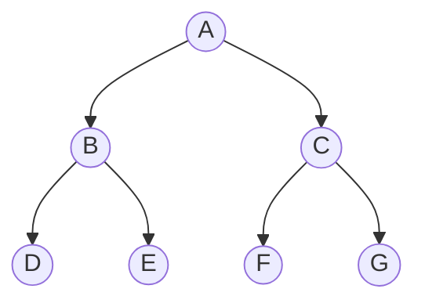

A* (A estrella) es un  [[Algoritmo de Búsqueda|algoritmo de búsqueda]] utilizado para encontrar el camino más corto en un grafo o mapa, desde un punto de partida hasta un destino.

Evalúa los nodos combinando $g(n)$, el coste para alcanzar el nodo y $h(n)$, el coste de ir al nodo objetivo: $$f(n) = g(n) + h(n)$$
- $g(n)$: el costo real acumulado desde el inicio hasta el nodo actual.
- $h(n)$: una estimación del costo desde ese nodo hasta el objetivo.
- $f(n)$: costo total estimado si paso por ese nodo.

### ¿Por qué es heurístico?
Porque **no se limita a explorar ciegamente** (como [[BFS  (Breadth-First Search)|BFS]] o [[DFS  (Depth-First Search)|DFS]]), sino que **usa conocimiento adicional del problema** para guiar la búsqueda hacia la meta más rápido.
- La función $h(n)$  es la **[[Heurística|heurística]]**; un valor calculado a partir de propiedades del dominio.
- Ejemplo: en un mapa, usar la **distancia Manhattan** o **Euclidiana** como estimación de la distancia que falta.
- Ese conocimiento permite a A* *adivinar* por dónde conviene seguir antes de llegar realmente a la meta.
En otras palabras:
- Si $h(n) = 0 \to$ A* se convierte en un **Uniform Cost Search**, que **no es informada**.
- Con $h(n) \neq 0 \to$ la búsqueda se vuelve **informada**  o **heurística**, porque esta **guiada por una estimación**.

- Nodo expandido (**A**) $\to$ se sacó de la frontera y se generaron sus hijos.
- Nodo frontera (**B, C**) $\to$ fueron añadidos a la frontera tras la expansión.
- Nodos no visitados (**D, E, F, G**) $\to$ aún no han sido alcanzados.
Esto muestra cómo la búsqueda se avanza expandiendo un nodo, generando sus sucesores y actualizando la frontera.

### Ejemplo intuitivo
Cuando A\* decide qué nodo expandir, no lo hace *a ciegas* (como BFS o DFS), sino que prioriza los nodos con menor $f(n)$.
- $g(n)$: lo que ya costó llegar hasta aquí.
	- Es el **costo real acumulado** desde el estado inicial hasta el nodo actual.
	- Ejemplo: si cada movimiento cuesta 1 y hemos hecho 7 movimientos entonces $g(n) = 7$.
	- Si el terreno tiene pesos (pasto = 1, arena = 3), $g(n)$ refleja esa suma real.

- $h(n)$: lo que se estima que falta.
	- Es la heurística: una estimación del costo desde el nodo actual hasta el objetivo.
	- Nunca se ha recorrido todavía: es una *apuesta informada*.
	- Ejemplo: en una grilla 2D, la distancia Manhattan o Euclidiana al objetivo.

- $f(n)$: mezcla los dos.
	- Representa el **costo total estimado** si paso por este nodo: lo ya pagado + lo que falta según mi estimación.
	- A* expande siempre el nodo con **menor** $f(n)$ en la frontera.

Esto hace que A* sea **heurístico**: depende de un cálculo basado en un conocimiento del entorno, no solo en reglas abstractas de exploración.