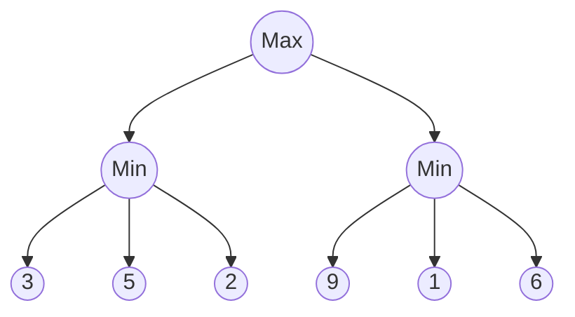

El algoritmo Minimax es una técnica que se usa principalmente en **juegos de dos jugadores** con suma cero (como ajedrez, tres en raya, damas, etc.). Su objetivo es decidir la mejor jugada posible, **suponiendo que el oponente también juega de manera óptima**.

**Idea Básica**
- Hay dos jugadores:
	- **Max**: intenta maximizar su ganancia
	- **Min**: intenta minimizar la ganancia del rival.
- El juego se puede representar como un **árbol de decisiones**, donde:
	- Cada nodo es un estado del juego.
	- cada rama es una jugada posible
	- Las hojas tienen un valor de utilidad (quién gana y cuánto).
- El algoritmo explora este árbol de juego y elige la jugada que **maximiza la ganancia mínima posible**.

**Ejemplo (Tres en raya)**
Imagina que le toca mover a **X**:
1. X analiza todas sus jugadas posibles.
2. Por cada jugada, asume que el oponente (**O**) contestará la mejor forma posible para él.
3. Luego X elige la jugada que le garantice el **mejor resultado en el por de los casos**

**Pseudocódigo**
```
1. Generar el arbol de juego desde el estado actual hasta cierta profunidad.
2. Asignar valores de utilidad a los estados terminales (ej: +1 si gana Max, -1 si gana Min, 0 si empatan).
3. Propagar valores hacia arriba:
	a. En los nodos Max, se elige el máximo valor de sus hijos.
	b. En el nodo Min, se elige el mínimo valor de sus hijos.
4. La raíz del árbol te da la jugada óptima.
```
**Ejemplo gráfico**


- En el primer **Min**: elige el menor: 2.
- En el segundo **Min**: elige el menor: 1.
- Luego la raíz (**Max**): elige el mayor: 2.
Max debería jugar hacia la izquierda, porque garantiza al menos 2.
---
### Poda Alfa-Beta
Cuando se explora el árbol en Minimax, hay ramas que no afectan al resultado fina, y por lo tanto no es necesario calcularlas. La **alfa-beta** detecta esas ramas y las descarta.

**Conceptos**
- **$\alpha$ (alfa)**: el mejor valor que el jugador **Max** puede asegurar hasta ahora en el camino explorado.
- **$\beta$ (beta)**: el mejor valor que el jugador **Min** puede asegurar hasta ahora en el camino explorado.
- Si el valor actual se vuelve **peor** de lo que un jugador ya puede conseguir, entonces esa rama **se corta** (poda), porque ese jugador nunca la elegiría.

**Ventaja**
Minimax puro revisa todos los nodos del árbol (crece exponencialmente). Con **poda alfa-beta** evita revisar ramas innecesarias; puede reducir muchísimo la complejidad.

**Ejemplo gráfico con poda**
El **mismo** árbol del ejemplo anterior:

Si empezáramos por la izquierda:
- El primer Min elige 2.
- Ahora, en la derecha, si Min ve un valor $\leq 2$, ya puede decidir sin explorar más (porque Max nunca elegirá esa rama); cuando encuentre el **1**, ya no explora el **6**.

